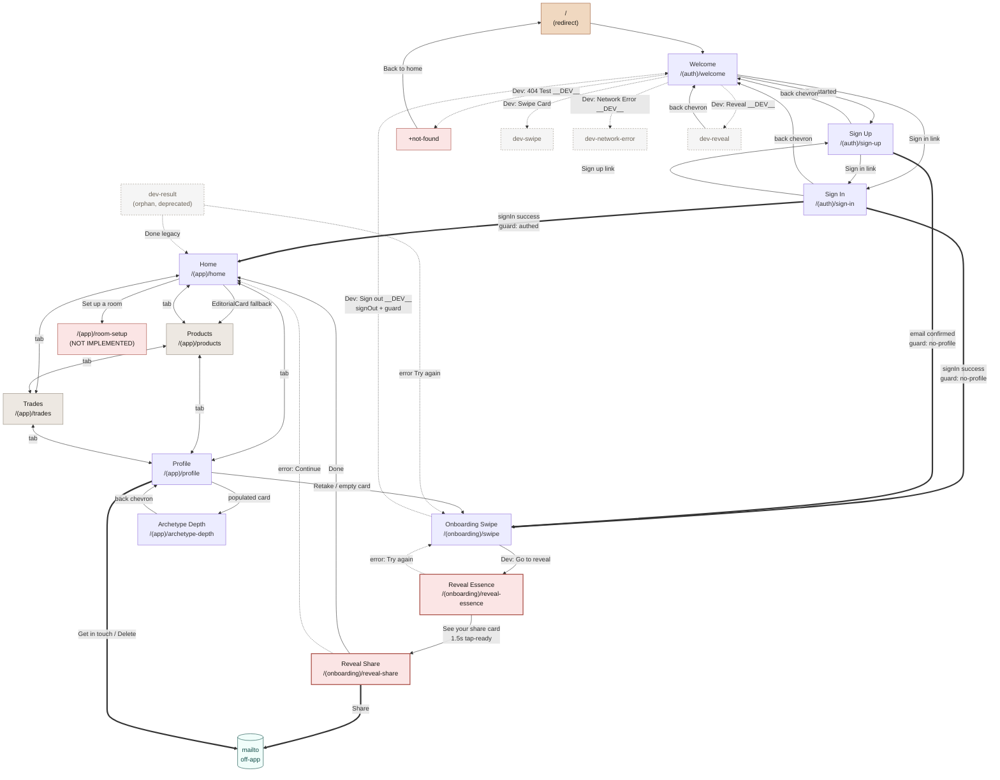

# Off-Ramp Audit (As-Is)

**Date:** 2026-05-04
**Status:** Artefact (one-time snapshot). See OFFRAMP-LINT-RULE on P2
governance queue for follow-up enforcement.
**Branch:** feat/reveal-1b-two-experience
**Auditor:** Claude Code

## Summary table

| Screen | Forward | Lateral | Escape | Notes |
|---|---|---|---|---|
| Index (`/`) | ✓ | — | — | redirect-only, no UI |
| Welcome | ✓ | ✓ | — | landing screen, no back (it IS the root) |
| Sign In | ✓ | ✓ | ✓ | back arrow + sign-up link + auth-state forward |
| Sign Up | ✓ | ✓ | ✓ | back arrow + sign-in link |
| Dev: Swipe | — | — | — | system back only (re-export, no router calls) |
| Dev: Network Error | — | — | — | system back only |
| Dev: Reveal | — | — | ✓ | header back chevron |
| Dev: Result | ✓ | — | — | orphan — no inbound; no back; deprecated |
| Onboarding Swipe | ✓ | — | ✓ | dev shortcut + `__DEV__` sign-out (added f256a29) |
| Reveal Essence | ✓ | — | ✗ | **DEAD-END for back** — only forward via CTA |
| Reveal Share | ✓ | ✓ | ✗ | **DEAD-END for back** — Done forward + native share |
| Home | ✓ | ✓ | — | tab nav + room CTA hits a 404 (no `/room-setup` route) |
| Products | — | ✓ | — | placeholder, tab nav only |
| Trades | — | ✓ | — | placeholder, tab nav only |
| Profile | ✓ | ✓ | — | tab nav + retake + depth + mailto; **no sign-out** |
| Archetype Depth | — | — | ✓ | back chevron with replace fallback |
| Not Found | ✓ | — | — | "Back to home" only |

Legend: ✓ = present, ✗ = absent and screen is on critical path, — = not
applicable or not on critical path. "Escape" means the user can leave the
screen back the way they came (back chevron, sign-out, dismiss). System
back gesture is platform-default and not counted as an in-app affordance.

## Journey diagram

Edge styles:
- Solid `-->` = user-action navigation
- Dashed `-.->` = user-action navigation that's `__DEV__`-guarded or
  conditional / error-state
- Thick `==>` = guard-driven redirect (auth state change → AuthGuard)
- Triple `===>` = navigation that leaves the app (mailto, share sheet)

Red-filled nodes mark technical dead-ends (Reveal Essence and Reveal
Share have no back affordance and no escape) and the missing
`/(app)/room-setup` route (HOME-01).

## Layout-level configuration

Captured once here so per-screen detail doesn't repeat.

### `app/_layout.tsx` — root
- Wraps `Slot` in `GestureHandlerRootView` and `ErrorBoundary`.
- **AuthGuard** lives here as a `useEffect` in `RootLayout` ([app/_layout.tsx:34-77](app/_layout.tsx#L34-L77)).
  Three branches based on `session` and `hasProfile` (from `useStyleProfile`):
  - `!session` AND segment in `(app)|(onboarding)` → `router.replace("/(auth)/welcome")`
  - `session && !hasProfile` AND segment in `(app)|(auth)` → `router.replace("/(onboarding)/swipe")`
  - `session && hasProfile` AND segment in `(auth)|(onboarding)` → `router.replace("/(app)/home")`
  - The redirect runs in a `setTimeout(..., 0)` to defer past the current render cycle.
- Logs `[AuthGuard] redirect decision` via `lib/log.createLogger("AuthGuard")` (added in workflow upgrade commit `95042c7`, then enriched with branch labels in `f256a29` chain).
- While `loading` (auth, fonts, profile fetch in flight) renders an `ActivityIndicator`. No way to cancel out of loading.

### `app/(auth)/_layout.tsx`
- `Stack` with `headerShown: false`. No layout-level back affordances; each screen owns its own header.

### `app/(onboarding)/_layout.tsx`
- `Stack` with `headerShown: false`. Same — every onboarding screen renders its own (or no) header. Notably, **reveal-essence and reveal-share do not render a header**, so there's no layout-level back chevron to fall back to.

### `app/(app)/_layout.tsx`
- `Tabs` with custom icon set (phosphor) and `headerShown: false`.
- Four visible tabs: home, products, trades, profile.
- One hidden tab: `archetype-depth` with `href: null` — routable but no tab-bar entry.
- Tab bar **always renders** while a route in this group is active. It serves as the lateral off-ramp on every `(app)` screen — but it's also the only off-ramp on the placeholder Products and Trades screens.
- No sign-out, settings, or "more" action surfaces at layout level.

## Per-screen detail

### Index
- **Route:** `/`
- **File:** [app/index.tsx](app/index.tsx)
- **Entry points:** Cold start, deep link to root, `not-found` "Back to home" press, AuthGuard's `(auth)` redirect target (transitively).
- **Exits the screen has:** `<Redirect href="/(auth)/welcome" />` on mount — fires before any UI paints. Effectively a route-level alias to `/(auth)/welcome`.
- **Exits the screen lacks (technically):** N/A — there is no UI to lack affordances on.
- **Auth/guard behaviour:** Renders independent of auth state (it just redirects). AuthGuard then takes over from welcome.
- **Encounter frequency (topology placeholder):** high — every cold start without a deep link hits this first.

### Welcome
- **Route:** `/(auth)/welcome`
- **File:** [app/(auth)/welcome.tsx](app/(auth)/welcome.tsx)
- **Entry points:** Cold start (via `/` redirect), AuthGuard's `no-session` branch, `not-found` "Back to home" (via `/`), Dev Reveal harness back chevron.
- **Exits the screen has:**
  - "Get started" CTA → `router.push("/(auth)/sign-up")` (user_action)
  - "Sign in" link → `router.push("/(auth)/sign-in")` (user_action)
  - "Dev: Swipe Card" Pressable → `router.push("/(auth)/dev-swipe")` (user_action). **Note:** NOT `__DEV__`-guarded — visible in production builds.
  - `__DEV__`: "Dev: Crash Test" → renders `<CrashTest />` inline (no navigation)
  - `__DEV__`: "Dev: 404 Test" → `router.push("/this-route-does-not-exist")` → resolves to `+not-found`
  - `__DEV__`: "Dev: Network Error Test" → `router.push("/(auth)/dev-network-error")`
  - `__DEV__`: "Dev: Reveal" → `router.push("/(auth)/dev-reveal")`
- **Exits the screen lacks (technically):** No back chevron (it IS the entry point post-redirect). System back gesture in Expo Go on iOS exits the app.
- **Auth/guard behaviour:** AuthGuard never redirects AWAY from welcome by itself (welcome is the `(auth)` segment; only the `authed` branch would target it, and that branch only fires when `segment === "(auth)"|"(onboarding)"` — meaning a user who has a profile and lands on welcome will be bounced to `/(app)/home`).
- **Encounter frequency (topology placeholder):** high

### Sign In
- **Route:** `/(auth)/sign-in`
- **File:** [app/(auth)/sign-in.tsx](app/(auth)/sign-in.tsx)
- **Entry points:** Welcome's "Sign in" link, Sign Up's "Sign in" link, AuthGuard's `no-session` branch (when user was signed in then signed out — though no in-app surface yet exists for this transition outside the dev sign-out button).
- **Exits the screen has:**
  - Header back arrow → `router.back()` (user_action; depends on stack depth)
  - "Sign up" footer link → `router.replace("/(auth)/sign-up")` (user_action; uses replace, not push, so not a stack push)
  - Internal sub-state: "Forgot password?" toggles to a reset-password panel inside the same route. The reset panel has its own back chevron and "Back to sign in" link, both of which clear the sub-state — these stay on the same route.
  - **Forward (implicit, guard-driven):** successful `signIn` mutates `session`, AuthGuard redirects to `/(app)/home` or `/(onboarding)/swipe` depending on profile state.
- **Exits the screen lacks (technically):** None at the technical level — back, sideways, and forward are all wired.
- **Auth/guard behaviour:** While on this screen with no session, AuthGuard does NOT redirect (segment is `(auth)`, no-session branch only redirects from `(app)|(onboarding)`).
- **Encounter frequency (topology placeholder):** high

### Sign Up
- **Route:** `/(auth)/sign-up`
- **File:** [app/(auth)/sign-up.tsx](app/(auth)/sign-up.tsx)
- **Entry points:** Welcome's "Get started" CTA, Sign In's "Sign up" link.
- **Exits the screen has:**
  - Header back arrow → `router.back()` (user_action)
  - "Sign in" footer link → `router.replace("/(auth)/sign-in")` (user_action)
  - Privacy policy "Privacy policy" link → opens an iOS-style `Alert.alert(...)` dialog (no navigation)
  - **Forward (implicit, guard-driven):** successful `signUp` shows the `checkEmail` success message in-place. After the user confirms the email link (out of app) and the session activates, AuthGuard's `no-profile` branch routes to `/(onboarding)/swipe`.
- **Exits the screen lacks (technically):** None at the technical level — though the in-app "you're signed up, go check email" experience is a soft-stop where the user is expected to leave the app and return via email link.
- **Auth/guard behaviour:** While on this screen with no session, AuthGuard does NOT redirect (`(auth)` segment).
- **Encounter frequency (topology placeholder):** high

### Onboarding Swipe
- **Route:** `/(onboarding)/swipe`
- **File:** [app/(onboarding)/swipe.tsx](app/(onboarding)/swipe.tsx)
- **Entry points:** AuthGuard's `no-profile` branch (signed-in user without `style_profiles` row), Profile's Retake action, Profile's empty ArchetypeIdentityCard tap, reveal-essence's "Try again" error state, dev-result's "Try again" error state.
- **Exits the screen has:**
  - "Dev: Go to reveal" Pressable → `router.replace("/(onboarding)/reveal-essence")` (user_action). NOT `__DEV__`-guarded — present in production builds because the screen itself is a stub for the unbuilt SwipeDeck (S2-T2).
  - `__DEV__`: "Dev: Sign out" Pressable → `supabase.auth.signOut()` + `lib/log.createLogger("OnboardingSwipe")` debug logs. Session change triggers AuthGuard `no-session` branch → welcome. Added in commit `f256a29` as a HOME-SIGNOUT-01 short-term unblock.
- **Exits the screen lacks (technically):** No back chevron, no proper "I don't want to do this quiz right now" affordance for production users (the `__DEV__` sign-out doesn't ship). Once the real SwipeDeck (S2-T2) lands, escape will be a design decision; today, the gap is visible.
- **Auth/guard behaviour:** AuthGuard does NOT redirect this screen unless session changes. While `loading` is in flight from useAuth/useStyleProfile, the root layout shows ActivityIndicator instead.
- **Encounter frequency (topology placeholder):** high

### Reveal Essence
- **Route:** `/(onboarding)/reveal-essence`
- **File:** [app/(onboarding)/reveal-essence.tsx](app/(onboarding)/reveal-essence.tsx)
- **Entry points:** Onboarding swipe's "Dev: Go to reveal" button. Future: real SwipeDeck completion path (S2-T2).
- **Exits the screen has:**
  - "See your share card" CTA, fades in at 1.5 s, with a tap-ready ref guard preventing earlier taps → `router.push("/(onboarding)/reveal-share")` (user_action)
  - **Error state only:** "Try again" button → `router.replace("/(onboarding)/swipe")`
- **Exits the screen lacks (technically):** **No back affordance.** No header chevron, no cancel button, no "skip" option. If the user ends up here mid-flow without an `archetype_history` row, the error state catches them — but on the success path, the only exit is forward to reveal-share.
- **Auth/guard behaviour:** Reads `session.user.id` to look up `archetype_history` and stamp `users.reveal_completed_at`. If `!userId` it sets state error. AuthGuard governs membership in `(onboarding)` — a logged-out user reaching this URL gets bounced to welcome.
- **Encounter frequency (topology placeholder):** high

### Reveal Share
- **Route:** `/(onboarding)/reveal-share`
- **File:** [app/(onboarding)/reveal-share.tsx](app/(onboarding)/reveal-share.tsx)
- **Entry points:** Reveal essence's "See your share card" CTA. Optionally `?archetype=<id>` query param for dev preview.
- **Exits the screen has:**
  - "Done" button → `router.replace("/(app)/home")` (user_action)
  - "Share" button → `Share.share({...})` — invokes native share sheet, no in-app navigation. Returns to the same screen on dismiss/share-complete.
  - **Error state only:** "Continue" button → `router.replace("/(app)/home")`
- **Exits the screen lacks (technically):** **No back affordance.** Forward (Done) and lateral (Share) are present. Going back to reveal-essence isn't possible from here.
- **Auth/guard behaviour:** Reads session for the engagement event. AuthGuard governs `(onboarding)` membership.
- **Encounter frequency (topology placeholder):** high

### Home
- **Route:** `/(app)/home`
- **File:** [app/(app)/home.tsx](app/(app)/home.tsx)
- **Entry points:** AuthGuard's `authed` branch, reveal-share's Done, dev-result's Done, EditorialCard CTAs (in some configurations), tab bar Home icon.
- **Exits the screen has:**
  - **Forward:** "Set up a room" CTA in empty state → `router.push("/(app)/room-setup")` — **target route does not exist** (HOME-01). Lands on `+not-found`.
  - **Forward:** "Add another room" CTA on rooms-with-recommendations footer → same broken target.
  - **Lateral:** EditorialCard CTA on the wishlist-fallback variant → `router.push("/(app)/products")`
  - **Lateral:** EditorialCard CTA on the quiet-welcome variant → same target as above
  - **Lateral:** Tab bar (products, trades, profile)
  - EditorialCard with a real editorial row honours `cta_url` (could be in-app or external — depends on data; not statically determinable).
  - Pull-to-refresh → re-runs fetches, no navigation.
- **Exits the screen lacks (technically):** No sign-out, no settings, no "leave home" affordance other than tabs and the broken room-setup CTA.
- **Auth/guard behaviour:** AuthGuard governs `(app)` membership. While `loading` from `useAuth` or `useStyleProfile`, root shows ActivityIndicator (so this screen flashes through "Loading..." briefly while its own `loading` is in flight).
- **Encounter frequency (topology placeholder):** high

### Products
- **Route:** `/(app)/products`
- **File:** [app/(app)/products.tsx](app/(app)/products.tsx)
- **Entry points:** Tab bar Products icon, Home's EditorialCard fallback CTA, Sprint 2 catalog screens (not yet built).
- **Exits the screen has:**
  - **Lateral:** Tab bar (home, trades, profile)
- **Exits the screen lacks (technically):** **No content at all.** The screen is a placeholder showing only the tab title `STRINGS.tabs.products`. No CTAs, no buttons, no links. Tab bar is the only off-ramp.
- **Auth/guard behaviour:** AuthGuard governs `(app)` membership.
- **Encounter frequency (topology placeholder):** medium — discoverable via tab bar but no reason to linger.

### Trades
- **Route:** `/(app)/trades`
- **File:** [app/(app)/trades.tsx](app/(app)/trades.tsx)
- **Entry points:** Tab bar Trades icon.
- **Exits the screen has:**
  - **Lateral:** Tab bar (home, products, profile)
- **Exits the screen lacks (technically):** Same as Products — placeholder, no in-screen affordances. Tab bar is the only off-ramp.
- **Auth/guard behaviour:** AuthGuard governs `(app)` membership.
- **Encounter frequency (topology placeholder):** low

### Profile
- **Route:** `/(app)/profile`
- **File:** [app/(app)/profile.tsx](app/(app)/profile.tsx)
- **Entry points:** Tab bar Profile icon, Archetype Depth's back chevron fallback (`router.replace('/(app)/profile')`).
- **Exits the screen has:**
  - **Forward:** "Retake the style quiz" action → `router.push("/(onboarding)/swipe")`
  - **Forward:** ArchetypeIdentityCard (populated variant) tap → `router.push("/(app)/archetype-depth")` — navigation lives inside the card component at [src/components/organisms/ArchetypeIdentityCard.tsx](src/components/organisms/ArchetypeIdentityCard.tsx#L54)
  - **Forward:** ArchetypeIdentityCard (empty variant) tap → `router.push("/(onboarding)/swipe")` — internal to the card
  - **Lateral:** Tab bar (home, products, trades)
  - **Off-app:** "Something wrong? Get in touch" → `openProfileGetInTouch` → mailto via `Linking.openURL`
  - **Off-app:** "Delete my account" → `openProfileDeleteAccount` → mailto
- **Exits the screen lacks (technically):** **No sign-out** — `useAuth` exposes `signOut` but Profile does not consume it (HOME-SIGNOUT-01). The function is unreachable from the UI in production.
- **Auth/guard behaviour:** AuthGuard governs `(app)` membership. The screen itself reads `is_anonymous` to hide retake/delete actions for anonymous sessions (no persistent account to operate on).
- **Encounter frequency (topology placeholder):** high

### Archetype Depth
- **Route:** `/(app)/archetype-depth`
- **File:** [app/(app)/archetype-depth.tsx](app/(app)/archetype-depth.tsx)
- **Entry points:** Profile's ArchetypeIdentityCard (populated variant) tap.
- **Exits the screen has:**
  - **Escape:** Header back chevron → `router.canGoBack() ? router.back() : router.replace("/(app)/profile")`
  - **Error state:** "Back" button on the can't-load-style state → `router.replace("/(app)/profile")`
- **Exits the screen lacks (technically):** None — back is wired with a fallback for direct-deep-link entry.
- **Auth/guard behaviour:** Hidden from tab bar via `href: null`. AuthGuard governs `(app)` membership. The Tabs layout still wraps it, but the tab bar item is absent (so users navigate by chevron, not tabs).
- **Encounter frequency (topology placeholder):** medium

### Not Found (`+not-found`)
- **Route:** `/+not-found`
- **File:** [app/+not-found.tsx](app/+not-found.tsx)
- **Entry points:** Any unmatched route. Currently reachable in production via Home's "Set up a room" CTA → `/room-setup` (broken, HOME-01) and via Welcome's `__DEV__` "Dev: 404 Test" button.
- **Exits the screen has:**
  - "Back to home" → `router.replace("/")`. Returns to the redirect chain (which then routes per AuthGuard).
- **Exits the screen lacks (technically):** No router.back() — fresh navigations to a 404 may not have a stack to back to. The `router.replace("/")` is the right pattern here.
- **Auth/guard behaviour:** Renders unauthenticated. The "Back to home" exit lands on `/` which routes through index → welcome → AuthGuard.
- **Encounter frequency (topology placeholder):** not_on_path — but currently elevated in dev because of HOME-01.

### Dev: Reveal
- **Route:** `/(auth)/dev-reveal`
- **File:** [app/(auth)/dev-reveal.tsx](app/(auth)/dev-reveal.tsx)
- **Entry points:** Welcome's `__DEV__` "Dev: Reveal" button. (Comment also mentions a hidden double-tap handler on welcome — not currently wired.)
- **Exits the screen has:**
  - Header back chevron → `router.back()`
  - Native Share sheet (within the in-screen reveal preview)
- **Exits the screen lacks (technically):** None — back is wired, dev-only screen.
- **Auth/guard behaviour:** Operates without a Supabase session (renders previews from local content). AuthGuard governs `(auth)` membership.
- **Encounter frequency (topology placeholder):** not_on_path (dev only)

### Dev: Swipe / Dev: Network Error
- **Routes:** `/(auth)/dev-swipe`, `/(auth)/dev-network-error`
- **Files:** [app/(auth)/dev-swipe.tsx](app/(auth)/dev-swipe.tsx), [app/(auth)/dev-network-error.tsx](app/(auth)/dev-network-error.tsx)
- **Entry points:** Welcome buttons. Dev-Swipe is reachable in production builds (button is NOT `__DEV__`-guarded); Dev-Network-Error is dev-only.
- **Exits the screen has:** None at the route file level — both files are bare re-exports of harness components (`SwipeCardHarness`, `NetworkErrorTest`). The harness components contain no `router.*` calls (verified by grep).
- **Exits the screen lacks (technically):** Both rely entirely on the system back gesture. No in-screen back affordance. iOS swipe-from-left gesture works because the route is in a Stack with `headerShown: false`; Android hardware back works for the same reason.
- **Auth/guard behaviour:** AuthGuard governs `(auth)` membership.
- **Encounter frequency (topology placeholder):** not_on_path

### Dev: Result (orphan)
- **Route:** `/(auth)/dev-result`
- **File:** [app/(auth)/dev-result.tsx](app/(auth)/dev-result.tsx)
- **Entry points:** **None statically detected.** The file's banner comment marks it as deprecated by REVEAL-1B and slated for deletion. A repo-wide grep for `dev-result` finds no callers. Reachable only via direct URL entry (`exp://.../...dev-result`).
- **Exits the screen has:**
  - Tap-to-advance through 4 panels (in-screen state, no navigation)
  - Panel 4 "Done" → `router.replace("/(app)/home")`
  - Native Share sheet on Panel 4
  - Error state "Try again" → `router.replace("/(onboarding)/swipe")`
- **Exits the screen lacks (technically):** No back chevron, no per-panel back. If a user reaches this orphan route they can only forward to home or hit the error state. This is fine for a deprecated dev surface but flagged for completeness.
- **Auth/guard behaviour:** Reads `session.user.id` to fetch archetype history. Operates as if it were on the regular reveal path.
- **Encounter frequency (topology placeholder):** not_on_path

## Patterns & inconsistencies

Cross-cutting observations from looking at the whole rather than the parts:

**1. Two routes hit dead-ends with no back affordance.** Reveal Essence and Reveal Share are the technical dead-ends in the user flow. By design they're a forward-only ceremony — the share moment is supposed to feel terminal — but the current implementation provides zero technical escape. If a user gets stuck (e.g. the Edge Function fails silently, or they want to retry), there's no "back" or "skip". Reveal Essence catches this with its error-state Try-Again, but Reveal Share has no equivalent and the only `error` path Continue still pushes forward to home.

**2. AuthGuard is the de-facto navigator on auth transitions.** Sign In and Sign Up both rely on session state changes triggering AuthGuard, rather than calling `router.push` themselves on success. This works but is implicit — newcomers reading sign-in.tsx see "submit, no navigation, success?" and have to know about app/_layout.tsx's useEffect to understand what happens next. Worth a comment in those files referencing the guard.

**3. `/(app)/room-setup` does not exist** — Home's empty-state and single-room CTAs both push to it. Lands on `+not-found`. Captured as **HOME-01** in earlier handover; visible here as a broken edge from a high-traffic node.

**4. Sign-out is unreachable in production.** `useAuth` exposes `signOut` ([src/hooks/useAuth.ts:48-52](src/hooks/useAuth.ts#L48-L52)) but no production UI consumes it. The only call site is the `__DEV__`-guarded button on Onboarding Swipe (commit `f256a29`) — added explicitly as a temporary unblock for HOME-SIGNOUT-01. Production users have no in-app path to sign out.

**5. Tab bar is the only off-ramp on Products and Trades placeholders.** Once a user lands on these tabs, the only way out is to tap another tab. No content, no CTAs, no empty-state messaging. Captured as **DESIGN-06** in earlier handover.

**6. Dev affordances are inconsistently `__DEV__`-guarded.** Welcome has 4 buttons wrapped in `{__DEV__ && ...}` (Crash Test, 404 Test, Network Error Test, Reveal) and 1 button that is NOT guarded ("Dev: Swipe Card"). Onboarding Swipe has 1 unguarded ("Dev: Go to reveal") and 1 guarded ("Dev: Sign out"). The unguarded ones survive into production builds, where they remain visible to real users. Worth a sweep.

**7. Two patterns for in-screen back.** `router.back()` (sign-in, sign-up, dev-reveal) vs `router.canGoBack() ? router.back() : router.replace(...)` with a fallback (archetype-depth). The fallback pattern is safer — back is fine when arriving via push, but archetype-depth is also reachable from outside the (app) tabs (potentially via deep link in future), so the fallback covers that. The other screens don't yet have non-stack entry points.

**8. Stack vs Tabs makes back semantics inconsistent across groups.** Within `(auth)` and `(onboarding)`, back works as "previous in the navigation stack." Within `(app)`, the Tabs layout doesn't push/pop — switching tabs is sideways. Archetype Depth is in the Tabs group but hidden from the tab bar; its back chevron uses `router.back()` which DOES work because it gets pushed onto the Tabs' inner stack when you navigate from Profile. Confusing because the visible Tabs framing suggests "no back," but Archetype Depth is the exception.

**9. ArchetypeIdentityCard owns its own navigation.** Profile renders the card without an `onPress` prop; the card calls `router.push` internally based on its `variant`. This is a pattern (encapsulated navigation behaviour), not a bug, but it means a static read of profile.tsx alone misses two of its forward edges.

**10. AuthGuard logging is structured (good); other navigation is not.** Only AuthGuard redirects log via `lib/log.createLogger`. User-action navigations (router.push/replace from button presses) don't log. If a session ends up routing somewhere unexpected, only the AuthGuard branch is visible in Metro. Worth seeding a few `log.debug` calls on critical edges (reveal-share Done, profile retake) for the same diagnostic visibility.

## Limitations

### What I couldn't statically analyse

- **Dynamic route construction.** The codebase does not currently use `router.push(\`/${segment}/...\`)` patterns with computed segments — every router call is a string literal — so this is a non-issue today. Will become a blind spot if dynamic patterns appear later.
- **`cta_url` from `editorial_content` rows.** Home's EditorialCard renders a CTA whose target comes from a database row (`editorial.cta_url`). The Tier-2 (wishlist) and Tier-3 (quiet-welcome) variants use literal `/(app)/products`, but the Tier-1 (real editorial) target is data-driven. I cannot enumerate possible destinations without inspecting the live `editorial_content` table.
- **`Linking.openURL` mailto handlers.** The `support` lib functions (`openProfileGetInTouch`, `openProfileDeleteAccount`) leave the app via mailto. I treated these as `external_mailto` edges without inspecting the strings — the destinations are technically known (the support team's email address) but the navigation effect (leaving the app) is what matters here.
- **System back gesture variants.** I assumed `Stack`-grouped routes accept the iOS swipe-from-left and Android hardware back. Actual platform behaviour wasn't smoke-tested as part of this audit.

### Blind spots — categories this audit cannot detect at all

- **Deep links from outside the app.** `expo-router` routes can be opened via universal links / app links. This audit captures the route surface; it does not enumerate which routes would be sane entry points for a deep link or which would land on a broken state if entered directly (e.g. `reveal-share` with no `archetype_history` row, `archetype-depth` for a user with no profile).
- **Push notification entry points.** Future work; not yet implemented.
- **OAuth/SSO callback returns.** Sign-in is email/password only today; no OAuth. If added, the callback path would be a new entry node.
- **Share-sheet entry points.** Cornr's share artefacts are share sheets that go OUT of the app (reveal-share, dev-reveal, dev-result). Inbound share sheet handling (e.g. "Share to Cornr" from another app) is not implemented.
- **Email-confirmation deep link.** Sign-up's success message tells the user to check email. The confirmation link that returns them to the app is generated by Supabase auth; the redirect target depends on Supabase project configuration and the email template. Not statically detectable from code.
- **Custom URL scheme `cornr://`.** No `Linking.addEventListener` handler grep returned matches; assume no custom-scheme inbound handling.
- **Universal Link return after `Share.share`.** If a user shares the reveal-share message, taps the link from another app, it lands on cornr.co.uk (a marketing domain), not back into the app. Out of scope.

## Affordances claimed

This audit exercised the explicit affordances listed in the prompt:
- Flagged 10 cross-cutting patterns in "Patterns & inconsistencies" beyond the per-screen scope.
- Declared limitations honestly; did not fabricate coverage of `cta_url` data-driven targets, deep-link entry, push notifications, or OAuth.
- Did not skip any in-scope screen. The orphan `dev-result` was included as a node with no inbound edge rather than omitted.
- Did not fabricate a SwipeDeck off-ramp on Onboarding Swipe — flagged the stub explicitly.
- Used the topology-derived encounter frequency placeholder as instructed; marked all values as estimated and noted PostHog data will overwrite.
